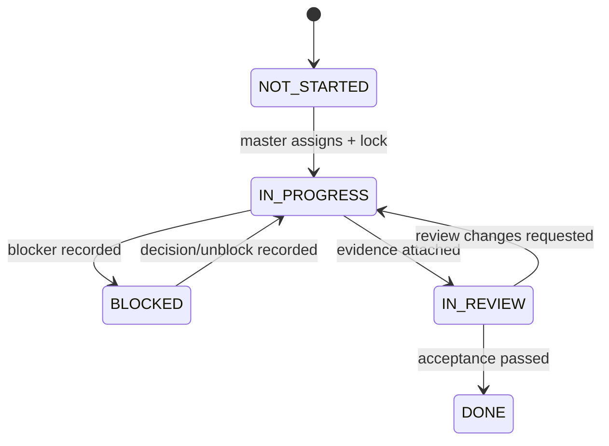

# Agent Operating Model — SI Warehouse Management

**เวอร์ชัน:** 1.0

**อ้างอิงงาน:** `SI_Warehouse_Implementation_Task_List.md`, PRD v1.7, SDD v1.6  
**วัตถุประสงค์:** ให้ Agent ทำงานเฉพาะทางอย่างปลอดภัย ติดตามได้ และกลับมาทำต่อได้โดยไม่ซ้ำซ้อนเมื่อ context/usage limit หมดหรือการทำงานหยุดลง

---

## 1. โครงสร้างทีมและอำนาจตัดสินใจ

| Agent | ความรับผิดชอบหลัก | ขอบเขตไฟล์หลัก | ห้ามทำเองโดยลำพัง |
|---|---|---|---|
| `master-agent` | แตกงาน, จัดลำดับ, lock งาน, ประสานข้ามทีม, ตรวจ acceptance, รายงานผู้บริหาร, update state/resume | `WORKFLOW_STATE.json`, `RESUME.md`, `DECISIONS.md`, task/spec documents | ไม่แก้ business implementation ของ Agent อื่น เว้นแต่รับช่วงอย่างเป็นทางการ |
| `ux-agent` | Sitemap, wireframe, prototype, Screen Spec, design token และ UX acceptance | `docs/ux/**`, design assets | เปลี่ยน business rule/API contract โดยไม่ผ่าน BA/BE review |
| `frontend-agent` | Angular routes, components, responsive UI, scan/mobile, frontend tests | `apps/frontend/**` | แก้ migration, backend authorization หรือ CI infra โดยไม่ประสานเจ้าของ |
| `backend-agent` | NestJS modules, domain service, REST API, auth guards, queue, integration tests | `apps/backend/src/**` ยกเว้น migration | แก้ schema/migration หรือ API contract ที่อนุมัติแล้วโดยไม่ผ่าน database/master review |
| `database-agent` | PostgreSQL schema, TypeORM migration, indexes, seed, transaction/lock, restore verification | `apps/backend/**/migrations/**`, `infra/db/**`, schema docs | เปลี่ยน business workflow หรือ frontend contract โดยไม่ผ่าน master/BE review |
| `cicd-agent` | Docker, Compose, Nginx, CI/CD, secret policy, health, monitoring, backup/runbook | `infra/**`, `.github/**`, pipeline files | เก็บ secret จริง, แก้ application business logic |
| `qa-agent` | Test plan, fixtures, E2E, regression, performance/security test, defect evidence | `tests/**`, `docs/qa/**` | ปิด defect หรือ mark task DONE เองโดยไม่มีผลทดสอบ |
| `security-reviewer` | Threat review, RBAC/data scope, upload/security headers, dependency/license review | `docs/security/**`, review report | เปลี่ยน feature scope; ส่ง finding ให้ master ตัดสินใจ |

**ผู้อนุมัติทางธุรกิจ:** PM/ผู้แทนคลัง/จัดซื้อ/การเงิน อนุมัติ Gate และ workflow; Master Agent บันทึกผลใน `DECISIONS.md`

---

## 2. การมอบหมายงานตาม Phase

| Phase | Agent นำ | Agent สนับสนุน/Reviewer | ผลที่ Master ต้องรายงาน |
|---|---|---|---|
| P0 Environment | `cicd-agent` | backend, database, frontend, qa, security | Compose/CI/health/migration/storage พร้อมหรือ blocker |
| P1 Visual First | `ux-agent` | frontend, qa, PM/ผู้แทนธุรกิจ | % wireframe, เมนูที่อนุมัติ/ค้าง, decision ที่ต้องการ |
| P2 Menu Detail | `master-agent` + `ux-agent` | backend, database, frontend, qa, security | % Screen Spec/API contract, backlog ที่พร้อมพัฒนา |
| P3 Platform/Master | backend + frontend | database, cicd, qa, security | Login/RBAC/Item/Location และผล UAT |
| P4 BOQ/Procurement | backend | frontend, database, qa, PM/จัดซื้อ | readiness/Supplier-held scenario ผ่านหรือไม่ |
| P5 Warehouse/Opening | backend + database | frontend, qa, คลัง, security | ledger/serial/FIFO/cutover test และความเสี่ยง |
| P6 Delivery Mobile | frontend + backend | qa, cicd, คลัง/คนส่ง/ช่าง | mobile E2E, proof/paper return usability |
| P7 Reports/Go-live | qa + master | backend, frontend, database, cicd, ผู้ใช้ธุรกิจ | UAT, defects, cutover rehearsal, go/no-go |

การส่งงานเป็นแบบ **หนึ่ง Task ID ต่อหนึ่ง Agent นำ**; Agent อื่นทำได้เฉพาะ subtask ที่ Master แยกและระบุไฟล์/ผลส่งมอบชัดเจน

---

## 3. กติกาการทำงานร่วมกัน (Mandatory Rules)

1. ก่อนเริ่มทุกครั้ง Agent ต้องอ่าน `AGENTS.md` → `WORKFLOW_STATE.json` → `RESUME.md` → Task List → Screen Spec/SDD ที่เกี่ยวข้อง
2. Master Agent เป็นผู้เปลี่ยน task เป็น `IN_PROGRESS` และออก task lock ก่อน Agent เริ่มแก้ไฟล์
3. หนึ่ง Agent ทำงาน active ได้เพียงหนึ่ง Task ID; ห้ามเริ่ม task อื่นระหว่างรอ review เว้นแต่ Master ปลด lock เป็นลายลักษณ์อักษรใน state
4. ทุก task ต้องมี: เป้าหมาย, ขอบเขตไฟล์, dependency, acceptance criteria, owner, reviewer และคำสั่งทดสอบก่อนเริ่ม
5. Agent แก้ได้เฉพาะขอบเขตไฟล์ของตน; shared file เช่น API contract, dependencies, compose, schema และ task state ต้องขอ Master lock ก่อนเสมอ
6. เปลี่ยน API, schema, state machine, permission หรือ environment variable ต้องเป็น **Change Request**: ระบุผลกระทบ → review โดยเจ้าของที่เกี่ยวข้อง → Master บันทึก decision → จึงแก้โค้ด
7. ไม่ mark `DONE` จนกว่า test ที่เกี่ยวข้องผ่าน, reviewer ตรวจ, หลักฐานถูกใส่ใน state และผลส่งมอบอยู่ใน commit/PR ที่ระบุได้
8. ไม่ hard delete ข้อมูล/ไฟล์/ migration ที่เผยแพร่แล้ว; ใช้ migration/rollback/reversible action ตาม SDD
9. ห้ามใส่ secret, token, ข้อมูลลูกค้าจริง หรือรูปเอกสารจริงใน repository, log หรือ fixture
10. หากพบ requirement ขัดกัน ให้หยุดที่จุดปลอดภัย, mark `BLOCKED` และส่งคำถามที่ตอบได้ชัดเจนให้ Master; ห้ามเดาเพื่อเดินหน้าต่อ

---

## 4. Task Contract ที่ Master ต้องออกก่อนเรียก Agent

```markdown
Task ID: P#-##
Title: ชื่องานสั้นและผลลัพธ์ที่ตรวจได้
Owner Agent: backend-agent
Reviewer: database-agent, qa-agent
Status: IN_PROGRESS
Objective: ...
In scope: ...
Out of scope: ...
File lock / allowed paths: ...
Dependencies: ...
Acceptance criteria: ...
Verification commands: ...
Expected evidence: commit/PR, test output, screenshot or API example
Handoff to: ...
```

เมื่อ Agent ส่งมอบ ต้องตอบกลับ Master ด้วย `Task ID`, สิ่งที่เปลี่ยน, ไฟล์ที่แก้, ผลทดสอบ, commit/PR, ข้อจำกัด และงานถัดไปที่พร้อมรับต่อ

---

## 5. Durable State และการป้องกันงานซ้ำ

### 5.1 ไฟล์ที่เป็นแหล่งความจริง

| ไฟล์ | เจ้าของการอัปเดต | ใช้ทำอะไร |
|---|---|---|
| `AGENTS.md` | Master/Tech Lead | กติกาถาวรที่ทุก Agent ต้องปฏิบัติ |
| `WORKFLOW_STATE.json` | Master Agent เท่านั้น | สถานะ task/phase, lock, dependency, evidence, blocker และ next action แบบ machine-readable |
| `RESUME.md` | Master Agent ทุก milestone | สรุปภาษาคนสำหรับกลับเข้าทำงานใน context ใหม่ |
| `DECISIONS.md` | Master Agent | บันทึกการตัดสินใจ ผู้อนุมัติ วันที่ ผลกระทบ และสิ่งที่ไม่ควรย้อนทำ |
| `SI_Warehouse_Implementation_Task_List.md` | Master/PM | Backlog ระดับ Phase และเกณฑ์ความสำเร็จ |
| `docs/specs/<task-id>.md` | Agent เจ้าของ + reviewer | รายละเอียดของ task ที่พัฒนาได้จริง |

`WORKFLOW_STATE.json` และ `RESUME.md` ต้องถูก commit พร้อมหรือก่อน commit ที่เปลี่ยนสถานะงาน เพื่อไม่ให้ history ของโค้ดกับ history ของงานไม่ตรงกัน

### 5.2 State Transition และ Task Lock



- Lock ต้องมี `task_id`, owner agent, allowed paths, start checkpoint และ expiry/heartbeat
- ถ้า Agent หยุดโดยไม่ส่ง handoff เกินรอบเวลาที่กำหนด Master ต้อง mark lock เป็น `STALE`; ห้าม Agent ใหม่แก้ต่อจน Master ตรวจ git status, commit ล่าสุด, test evidence และ state แล้ว
- Task ที่ `DONE` เปลี่ยนได้เฉพาะกรณี verification พิสูจน์ว่าไม่ผ่าน; Master ต้องเปิด rework task ใหม่และอ้างอิง task เดิม ไม่ย้อนเขียนสถานะเงียบ ๆ

---

## 6. Checkpoint Protocol สำหรับ Context/Usage Limit/การหยุดไม่ตั้งใจ

Agent ต้องสร้าง checkpoint **ก่อน** context เหลือน้อย, usage limit ใกล้หมด, ก่อนเปลี่ยนงานสำคัญ, หลัง test ผ่าน และก่อนส่งต่อ Agent อื่น โดยห้ามรอให้ session ถูกตัด

### สิ่งที่ Master ต้องบันทึกทุก checkpoint

1. Task ID, owner, สถานะ, % โดยประมาณ และ phase
2. commit/branch/working-tree status ล่าสุด
3. ไฟล์ที่แก้แล้วและไฟล์ที่ยังห้าม Agent อื่นแก้
4. คำสั่งที่รันและผล test ล่าสุด รวมถึงสิ่งที่ยังไม่ได้รัน
5. blocker/decision ที่รอ พร้อมผู้ตัดสินใจ
6. next action เพียง 1–3 ขั้นที่ทำต่อได้ทันที
7. ความเสี่ยงด้านข้อมูล/migration/secret และวิธีกลับสู่จุดปลอดภัย

### เมื่อเกิดเหตุไม่ปกติ

| เหตุการณ์ | การกระทำของ Agent | การกระทำของ Master เมื่อกลับมา |
|---|---|---|
| Context ใกล้เต็ม | หยุดหลัง checkpoint ที่ atomic; อย่าเริ่ม refactor ใหญ่ | อ่าน Resume/State แล้วทำ next action เท่านั้น |
| Usage limit ใกล้หมด | ส่ง handoff ที่มี test/evidence; ไม่ mark DONE | ยืนยัน lock และมอบ Agent ใหม่จาก state |
| Session ถูกปิด | ไม่ถือว่า task สำเร็จ | ตรวจ git status/commit/test ก่อน resume; mark stale หากไม่มี evidence |
| Test ล้มเหลว | บันทึกคำสั่ง, error summary, ผลกระทบ | จัดเป็น bug/subtask ไม่ให้ task หายจาก queue |
| พบ requirement ไม่ชัด | Mark BLOCKED พร้อมคำถาม/ตัวเลือก | บันทึกคำตอบใน Decisions และ reassign |

---

## 7. Resume Protocol ของ Master Agent

เมื่อเริ่ม session ใหม่ Master ต้องทำตามลำดับนี้ก่อนเรียก Agent ใด ๆ

1. อ่านไฟล์แหล่งความจริงทั้ง 5 ไฟล์ในข้อ 5.1
2. ตรวจ `current_phase`, `active_task`, lock ที่ stale, blockers และ `next_actions`
3. ตรวจ repository status, branch, commit ล่าสุด, migration status และผล test ล่าสุดที่บันทึกไว้
4. เปรียบเทียบ state กับไฟล์จริง; หากไม่ตรง ให้ถือว่า **state ยังไม่ยืนยัน** และสร้าง reconciliation task ก่อนเริ่ม feature ใหม่
5. ดำเนินต่อเฉพาะ `next_actions` ของ task ที่ active; ห้ามสร้างงานซ้ำจากการจำ conversation
6. หาก task เดิมไม่มีหลักฐานพอ ให้เปลี่ยนเป็น `BLOCKED` หรือเปิด verification subtask ไม่เริ่มแก้โค้ดใหม่ทันที
7. หลังมีความคืบหน้า meaningful milestone ให้ update state/resume/decision, run verification และ commit ในสภาพที่ปลอดภัย

---

## 8. รูปแบบรายงานความคืบหน้าของ Master Agent

### รายงานสั้นหลังทุก milestone

```markdown
Checkpoint: 2026-09-24T09:30:00+07:00
Phase/Task: P0 / P0-05
Status: IN_REVIEW (80%)
Owner/Reviewer: cicd-agent / backend-agent, qa-agent
Completed: Docker Compose และ health endpoint พร้อม
Evidence: commit abc123; `docker compose up` ผ่าน; รายงาน test อยู่ที่ ...
Blocked/Risk: ยังรอเลือก registry สำหรับ production image
Next actions: 1) QA smoke test 2) master review 3) close P0-05
```

### รายงานผู้บริหารรายสัปดาห์

- ภาพรวม Green/Amber/Red และ % ของแต่ละ Phase
- Gate ที่ผ่านและ Gate ที่ต้องการการอนุมัติ
- งาน DONE/IN_PROGRESS/BLOCKED และผลกระทบต่อวัน Go-live
- 3 ความเสี่ยงสูงสุด พร้อมเจ้าของและวันที่ต้องตัดสินใจ
- ตัวอย่างหน้าจอ/ผลทดสอบที่เพิ่มขึ้นในสัปดาห์นั้น
- แผนสัปดาห์ถัดไปไม่เกิน 5 ผลลัพธ์ที่ตรวจสอบได้

---

## 9. Definition of Ready / Done สำหรับ Agent Task

**Ready เมื่อ:** มี Task Contract, owner/reviewer, acceptance criteria, dependency พร้อม, file lock แล้ว และไม่ขัด Gate ของ Phase

**Done เมื่อ:** โค้ด/เอกสารผ่าน review, test ผ่าน, evidence และ audit/resume ถูกบันทึก, ไม่มี blocker ที่ซ่อนอยู่ และ Master ปลด lock/เปลี่ยน state เป็น `DONE`
